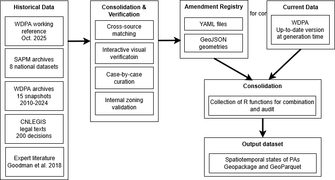
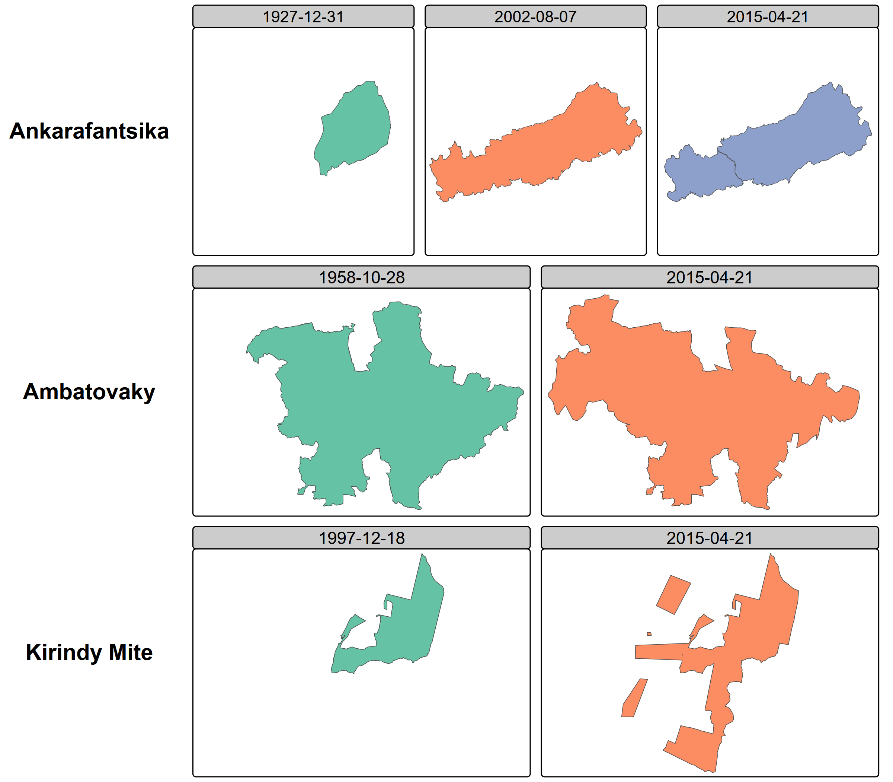
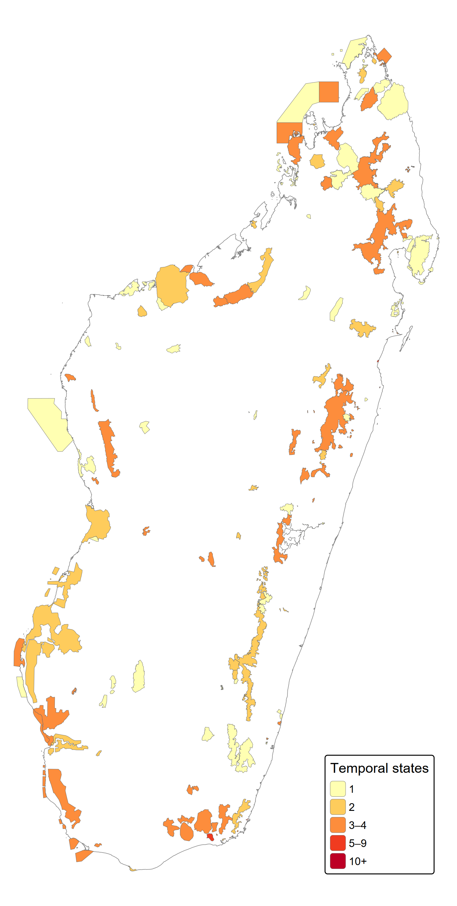
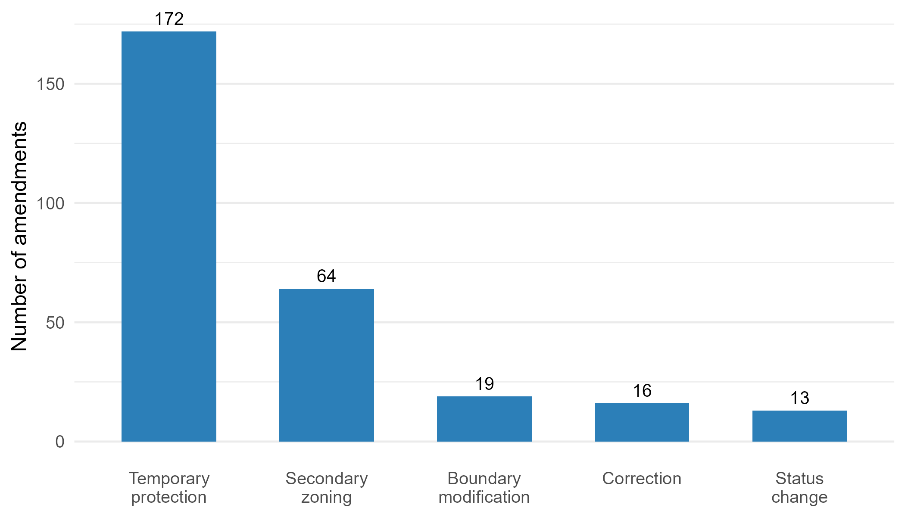

# Background & Summary

Geospatial data on protected areas occupy a central place in research assessing conservation outcomes on the environment and human wellbeing. Whether studies assess the effect of protection on deforestation, measure the economic returns of ecotourism, or monitor progress toward international conservation targets, they depend on accurate spatial boundaries and status information. The World Database on Protected Areas (WDPA), maintained by the UN Environment Programme World Conservation Monitoring Centre, serves this role as the most comprehensive global inventory, documenting over 270,000 sites across more than 240 countries and territories [@bingham2019b]. Over the past two decades, the WDPA has become the default spatial reference for conservation planning, effectiveness assessments, and reporting against targets such as Aichi Biodiversity Target 11 and, more recently, the Kunming-Montreal Global Biodiversity Framework goal to protect 30% of the planet by 2030 [@Maxwell2020].

The WDPA, however, was designed as a snapshot database. It records the current state of each protected area, and when boundaries or designations change, the previous configuration is overwritten. The WDPA user manual itself warns against using the STATUS_YR field for historical analysis, and degazetted sites are simply removed from the database [@Bingham2019a]. This structural limitation has been recognized in the literature on protected area downgrading, downsizing, and degazettement (PADDD). Symes et al. [-@symesWhyWeLose2016] examined the factors driving PADDD events in the tropics and subtropics, showing that protected areas are not permanent — they can be reduced, reclassified, or revoked entirely. @lewisDynamicsGlobalProtectedarea2019 quantified the net area flux in the global protected area estate from 2004 to 2016 by comparing successive WDPA snapshots, finding that an average of 1.1 million km² was removed from the database annually across 223 countries and territories. Their analysis, however, could not distinguish on-the-ground changes from data-quality corrections, and the snapshot-comparison method itself erases the intermediate states it seeks to document.

What remains largely unaddressed is the continuous evolution of ongoing protected areas. Between creation and the present, many sites undergo boundary modifications, status reclassifications (for instance from Strict Nature Reserve to National Park), governance changes, internal zoning, or temporary protection decrees. None of these transformations are preserved in the WDPA's current-state model: each update silently replaces the previous configuration, making it impossible to reconstruct what a protected area looked like at any given date in the past.

A further dimension that static snapshot databases fail to capture is the internal zoning of protected   areas. In many national systems, multi-use protected area categories — typically corresponding to IUCN Categories III to VI — are internally subdivided into zones with distinct levels of permitted human activity. In Madagascar, the Protected Area Management Code (Code de Gestion des Aires Protégées, COAP; Law 2015-005) requires such sites to delineate a strictly protected core zone (noyau dur), where extractive uses are prohibited and biodiversity conservation takes legal precedence, alongside internal buffer zones where regulated resource use by surrounding communities may be permitted. The term “buffer zone” is used in the literature to refer both to areas surrounding core zones within protected areas and to areas surrounding the external boundary of protected areas [@Ebregt2000]. To avoid ambiguity, we distinguish throughout this manuscript and dataset between “internal buffer zones” and “external buffer zones.” The temporal emergence of these zones is a critical feature of conservation trajectories: a protected area’s external boundary is typically established by an initial creation decree, while its core zone may be delimited and formalized either in that same decree or in the site’s management and development plan, together with the other zoning categories, at a later stage. Impact evaluations relying solely on the external boundary may therefore misattribute outcomes to the protected area as a whole, whereas the effective protection signal on land use, biodiversity, and community access operates principally at the core zone level.

This matters for researchers from all disciplines that study conservation (biology, ecology, economics, anthropology, etc.). For instance, when impact evaluations assume that current boundaries have remained unchanged since a protected area was established, they may treat recently added areas as if they had been protected for much longer, inducing a downward biais in their results. It is also relevant for policymakers, as protected areas have become a major instrument of spatial planning, with global terrestrial coverage exceeding 17% in 2023 [@unep2024]. It also matters for conservation practitioners and local stakeholders, because shared spatial references support more transparent and equitable management.

Madagascar offers a particularly instructive demonstration case. The island is one of the world's foremost biodiversity hotspots, with forests sheltering over 80% of its biodiversity and endemism rates exceeding 80% across many taxonomic groups [@Waeber2020]. Its conservation history spans colonial-era strict nature reserves, post-independence national parks, and a rapid expansion following the 2003 Durban Vision, in which the government committed to tripling the protected surface to six million hectares [@Waeber2020]. This complex trajectory has been meticulously documented by Goodman et al. [-@Goodman2018] in a three-volume monograph covering 98 terrestrial sites, while the national protected area system (Système des Aires Protégées de Madagascar, SAPM) has produced successive spatial datasets, and the national legislative database (CNLEGIS) contains the legal decisions underpinning each status change. Yet no single dataset has assembled these complementary sources into a unified temporal record.

The problem, however, is not specific to Madagascar. In most countries, the WDPA contains protected areas whose histories of boundary and status changes are lost. The temporal data model we present here is designed to be generalizable to any country where complementary sources can supplement the WDPA baseline.

This paper presents three contributions. First, a temporal data model that extends the WDPA with time-bounded states, validity periods, legal source references, and secondary zoning, applicable to any national context. Second, a demonstration dataset covering 123 terrestrial protected areas in Madagascar from 2000 to 2025. Third, an open collaborative infrastructure consisting of a YAML amendment registry and a deterministic consolidation engine that enables other researchers to audit, correct, and extend the dataset through standard version control workflows. An interactive companion website allows visual exploration and verification of the data.


# Methods

The dataset was constructed through a multi-step pipeline integrating four complementary data sources, cross-referencing them through spatial and textual matching, curating amendments through expert review, and consolidating them into temporal states using deterministic rules. Access to institutional datasets and validation processes was facilitated through close collaboration with national authorities, ensuring consistency with official records and operational practices. 

The complete methodology is documented in a reproducible notebook accompanying this paper (see supplementary material). We summarize the key steps below and illustrate the overall workflow in @fig-workflow.

{#fig-workflow width=100%}

## Input data

Four categories of input data were assembled: national data from the Madagascar Protected Area System (SAPM), historical snapshots of the WDPA, legal decisions from the national legislative database (CNLEGIS), and expert literature providing historical context and boundary information.
Eight successive spatial datasets from SAPM were harmonized: 

- ANGAP 2002: From the then-only protected area management agency (Agence nationale de gestion des aires protégées)
- MNP 2010: dataset produced by Madagascar National Parks (MNP), the name adopted by ANGAP (Agence Nationale pour la Gestion des Aires Protégées) in 2008 as part of an institutional and strategic reorientation aimed in particular at strengthening its long-term financial sustainability, in a context marked by the emergence of new actors — notably national and international conservation NGOs — in the co-management of newly established protected areas under the Durban Vision expansion
- SAPM evolution series (2001–2011): from the coordination body that gathered the conservation actors
- Vahatra 2017: a complementary source curated in the framework of the Goodman et al. [-@Goodman2018] monograph, which provides curated boundaries and status of 98 terrestrial protected areas up to date in 2015;
- SAPM 2017 and 2024 : dataset produced by Madagascar National Parks (MNP), the name adopted by ANGAP (Agence Nationale pour la Gestion des Aires Protégées) in 2008 as part of an institutional and strategic reorientation aimed in particular at strengthening its long-term financial sustainability, in a context marked by the emergence of new actors — notably national and international conservation NGOs — in the co-management of newly established protected areas under the Durban Vision expansionMadagascar is the new name of ANGAP, at a time where new management agencies emerged (international or local NGOs)
•	SAPM evolution series (2001–2011): from the coordination body that gathered the conservation actors
•	Vahatra 2017: a complementary source curated in the framework of the Goodman et al. (2018) monograph, which provides curated boundaries and status of 98 terrestrial protected areas up to date in 2015;
•	SAPM 2017 and 2024: Updated datasets coordinated by the Ministry of Environment and Sustainable Development (MEDD), which has ensured the overall governance and coordination of the protected area system, while working with multiple management entities including Madagascar National Parks and conservation NGOs
- Complementary sources identified through an archive searching and manual curation by MNP.

Each dataset was reprojected, geometries were repaired, and attributes were standardized to a common schema.

The WDPA historical archive provided 15 annual snapshots (2010–2024) obtained from the AWS Open Data registry and Google Earth Engine monthly archives, serving primarily to establish the baseline attributes and geometries for each protected area and to track schema evolution across versions. The Madagascar subset was extracted and reprojected to the Laborde projection (EPSG:29702), and Blake3 hashing was used to deduplicate identical geometries across snapshots.

Approximately 200 legal decisions (decrees, ministerial orders, interministerial orders) related to protected areas were extracted from the Centre National de Légistique (CNLEGIS), Madagascar's official legislative database. An automated pipeline combining web scraping, regular expression classification by decision type, and fuzzy string matching (Levenshtein distance) linked each decision to a WDPAID. This automated processing was complemented by systematic manual reading of legal texts to extract boundary descriptions, effective dates, and status changes not captured by the automated methods.

Additional historical context was drawn from the three-volume monograph by Goodman et al. [-@Goodman2018], which provides creation dates, historical boundaries, and status changes for 98 terrestrial protected areas, and from Waeber et al. [-@Waeber2020].

## Consolidation and verification

Records from all four sources were matched to WDPA identifiers through a combination of spatial matching (centroid distance and polygon overlap ratios) and string-distance matching on protected area names. This step resolved name variants and multi-polygon entities.

A Shiny web application was developed and deployed for domain expert review. domain expert review. The validation involved protected area managers, GIS specialists from MEDD and Madagascar National Parks, and researchers with long-term experience on Madagascar’s protected area system. The application overlays geometries from different sources and time periods on interactive Leaflet maps, with filtering by IUCN category, dataset of origin, and associated legal texts. This tool enabled systematic visual comparison of boundaries reported by different sources for each protected area. The companion website provides ongoing access to this verification interface.

Core zone shapefiles from five organizations (MEDD, MNP, MBG, GERP, WWF) were collected and validated against WDPA external boundaries through spatial containment checks, yielding 73 validated core zone geometries that were integrated as secondary zones in the temporal dataset.

For approximately 25 protected areas with complex histories, a detailed case-by-case review was conducted, cross-referencing legal decisions, historical boundaries from Goodman et al. [-@Goodman2018], and successive SAPM datasets. @fig-examples illustrates three such cases. Amendments were documented in Spatial Amendment Tables (SAT) for geometries and Feature Attribute Tables (FAT) for attributes, then exported to the canonical YAML format.

{#fig-examples width=100%}

## YAML amendment registry

All corrections and temporal information are stored in a registry of YAML files, one per protected area, accompanied by GeoJSON geometry files where boundaries differ from the WDPA baseline. YAML was chosen because it is human-readable without specialized software, auditable in that each amendment includes the legal source, effective date, and amendment type, and Git-friendly in that text-based diffs enable collaborative editing with full change history tracking. Automated validation checks detect duplicate entries, temporal overlaps, and missing geometries.

The registry documents four types of amendments: boundary modifications (legally documented changes to external limits), status changes (reclassifications such as from Strict Nature Reserve to National Park), corrections (errors in the WDPA regarding dates, statuses, or geometries), and secondary zoning (internal zones including core zones and buffer zones).

## Consolidation and Auditing Rules

The final temporal states are generated by a deterministic consolidation engine implemented in R, referred to as the Consolidation and Auditing Rules (CAR). The engine reads the WDPA baseline and the YAML amendment registry, applies explicit precedence rules, and produces the output dataset. The process follows a delta-only model in which amendments override specific WDPA attributes or geometries for defined time intervals while all other attributes are inherited from the baseline. Three core functions implement the pipeline: `generate_timeline()` identifies temporal breakpoints from all amendments for a given WDPAID, `find_active_amendments()` determines which amendments are active at each time point, and `consolidate_pa_states()` merges baseline attributes with active amendments to produce each temporal state. Because the rules are coded explicitly and the inputs are versioned, the entire transformation is reproducible and auditable.


# Data Records

The dataset is currently deposited on DataSuds, the institutional research data repository of the Institut de Recherche pour le Développement (IRD), which assigns a persistent DOI. The official reference is:

> Bedecarrats, Florent, Ramanantsoa, Seheno, Andrianambinina, Ollier D. , 2026, "Dynamic spatial conservation boundaries and internal zoning of Madagascar from 2000 to 2025", https://doi.org/10.23708/VN2TWC, DataSuds, VERSION PROVISOIRE

For the peer-review process, the consolidated dataset (`.gpkg` and `.parquet`) is currently available via a temporary secure cloud storage link or requires replicating via the source code, pending final permission from UNEP-WCMC for public redistribution of the derived WDPA geometries. The source code is hosted on GitHub at <https://github.com/BETSAKA/conservation-dynamic-madagascar> and archived via Software Heritage for long-term preservation and persistent identification.

The dataset is distributed in three complementary forms. The first is a GeoPackage file (`dynamic_wdpa_madagascar.gpkg`), an OGC standard format directly compatible with QGIS, ArcGIS, R, and Python. The second is a GeoParquet file (`dynamic_wdpa_madagascar.parquet`), a columnar geospatial format optimized for analytical workflows and now also supported by QGIS and ArcGIS in addition to Arrow-based tools in R and Python. The third is the YAML amendment registry (`amendments/`), containing per-protected-area YAML files documenting each amendment with its legal source, effective date, and type, accompanied by GeoJSON geometry files where boundaries differ from the WDPA baseline. YAML is a human-readable data serialization format used in this project to systematically document each protected area amendment in a text-based, version-controlled manner.

Each row in the output dataset represents one zone in one temporal state. A protected area with boundary changes and internal zoning will have multiple rows across time periods. @tbl-schema describes the fields.

| Field | Type | Description |
|---|---|---|
| `state_id` | Character | Unique identifier for each temporal state |
| `WDPAID` | Integer | WDPA identifier, enabling cross-reference with the global database |
| `valid_from` | Date | Start date of this state's validity period |
| `valid_to` | Date | End date of this state's validity period |
| `zone_type` | Character | Zone type: `external_boundary`, `core_zone`, `internal_buffer_zone`, or `external_buffer_zone` |
| `zone_name` | Character | Name of the zone, if applicable |
| `geometry` | Geometry | Polygon or multipolygon in WGS84 (EPSG:4326) |
| `NAME` | Character | Protected area name |
| `DESIG` | Character | Designation type |
| `IUCN_CAT` | Character | IUCN management category |
| `STATUS` | Character | Designation status |
| `STATUS_YR` | Integer | Year of current status |
| `GOV_TYPE` | Character | Governance type |
| `MANG_AUTH` | Character | Management authority |
| `amendment_source` | Character | Reference to the YAML amendment file or `"wdpa_baseline"` |

: Schema of the temporal states dataset. {#tbl-schema}

The dataset covers 123 terrestrial protected areas in Madagascar with a temporal span from 2000 to 2025. Protected areas have between one and several temporal states depending on the documented amendments. Secondary zones are included for 73 protected areas where validated core zone shapefiles were available. @fig-map shows the spatial distribution of protected areas colored by the number of documented temporal states, illustrating where the dataset adds information relative to the static WDPA.

{#fig-map width=70%}

The data model and the associated infrastructure are designed to be generalizable to any country or region where complementary sources can supplement the WDPA baseline, and extensible to the full diversity of protected area modifications including boundary changes, status reclassifications, governance changes, temporary protections, and any form of internal zoning.


# Technical Validation

Spatial overlap between the WDPA, successive SAPM versions, and the Vahatra dataset was quantified using mutual inclusion ratios. For each protected area present in multiple sources, the proportion of area shared between paired geometries was computed, flagging cases with less than 80% overlap for manual review. Date and status discrepancies between sources were systematically catalogued and resolved through legal text verification.

Every amendment in the YAML registry is linked to a specific legal decision identified by its decree or order number, date, and URL in the CNLEGIS database. Domain experts reviewed all amendments through the interactive Shiny dashboard, verifying that recorded boundary changes and status modifications match the corresponding legal texts.

Automated checks enforce three invariants across the dataset: no overlapping validity periods exist for the same zone of the same protected area; no temporal gaps exist in the coverage of external boundaries from the creation date to the reference date; and `valid_from` is strictly earlier than `valid_to` for every state.

All geometries were validated using `sf::st_make_valid()` in R. Core zones were verified to fall within their parent protected area's external boundaries using spatial containment checks. Coordinate reference system consistency was enforced across all source datasets.

@fig-amendments summarizes the types and counts of amendments documented in the registry. 

{#fig-amendments width=70%}


# Usage Notes

The GeoPackage and GeoParquet files can be opened directly in QGIS, ArcGIS, R (with the sf or arrow packages), or Python (with geopandas or pyarrow). The WDPAID field enables direct linkage with global WDPA analyses, allowing users to enrich the standard database with temporal information for Madagascar.

In the event that pre-compiled datasets cannot be distributed publicly due to WDPA licensing restrictions, users can easily generate the consolidated dataset themselves. By downloading the WDPA baseline directly from Protected Planet (<https://www.protectedplanet.net/>) to their local environment, users can run the open-source Consolidation and Auditing Rules (CAR) R scripts provided in our repository. These automatically apply all YAML amendments to compile the exact same historical spatio-temporal dataset locally.

For temporal queries, users can filter states by `valid_from` and `valid_to` to retrieve the configuration of any protected area at a given date. The `zone_type` field distinguishes external boundaries from internal zones, enabling analyses at different spatial scales.

The YAML amendment registry is designed for collaborative extension. Researchers with access to complementary sources — additional legal texts, historical maps, field boundary surveys — can propose new amendments via GitHub pull requests. The CAR engine will automatically integrate validated amendments into subsequent dataset releases.

Users should note that the WDPA baseline attributes are subject to UNEP-WCMC licensing terms regarding commercial use. The amendments and the temporal data model itself are released under a CC-BY 4.0 license. An interactive companion website provides visual exploration of the dataset, enabling users to browse individual protected areas, view their temporal trajectories, and compare boundaries across sources and time periods.


# Code Availability

All source code is available at <https://github.com/BETSAKA/conservation-dynamic-madagascar> under a CC-BY 4.0 license. The repository contains the complete Quarto book documenting all processing steps across nine chapters, the Shiny verification application, and the CAR consolidation engine. The code is archived via Software Heritage for long-term preservation, providing a persistent software identifier (SWHID).


# Acknowledgements

This work was conducted within the BETSAKA project, supported by KfW, Agence Française de Développement (AFD), Institut de Recherche pour le Développement (IRD), and Agence Nationale de la Recherche (ANR). The project is coordinated by IRD/UMI-SOURCE and the Université d'Antananarivo/CERED. We thank the Vahatra Association for the foundational monograph on Madagascar's protected areas, the CNLEGIS team for maintaining the national legislative database, and the organizations (MEDD, MNP, MBG, GERP, WWF) that shared core zone spatial data.


# Author Contributions

Following the CRediT (Contributor Roles Taxonomy) framework: F.B.: Conceptualization, Methodology, Software, Formal analysis, Data curation, Writing – original draft, Visualization, Project administration. S.R.: Investigation, Data curation, Validation, Resources, Writing – review & editing. O.D.A.: Investigation, Data curation, Validation, Resources, Writing – review & editing.


# Competing Interests

S.R. is a civil servant in charge of protected area governance at the Ministère de l'Environnement et du Développement Durable (MEDD) of Madagascar. O.D.A. heads the data information system and innovation unit at Madagascar National Parks (MNP). Producing and maintaining protected area information is part of their professional responsibilities. The authors have no financial conflicts of interest to declare.


# Funding

BETSAKA project, supported by KfW, Agence Française de Développement (AFD), Institut de Recherche pour le Développement (IRD), and Agence Nationale de la Recherche (ANR).


# References

```{=typst}
#set bibliography(title: none)
```

::: {#refs}
:::
